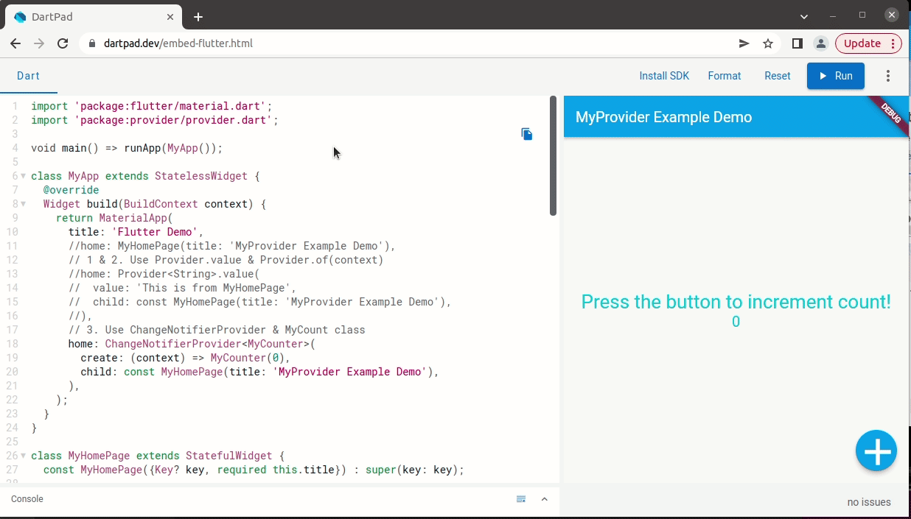

# thingsboard_app

Flutter Example.

## Demo:  
provider_example:  
  

navigator2_page_change_example:  
reference :  [Navigation and routing](https://docs.flutter.dev/development/ui/navigation), [Learning Flutter¡¦s new navigation and routing syste](https://medium.com/flutter/learning-flutters-new-navigation-and-routing-system-7c9068155ade)  
  